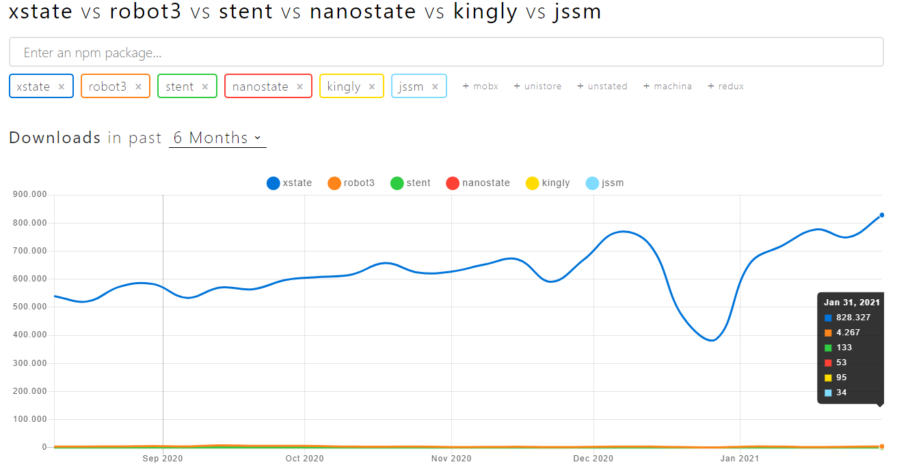

# State Machines and State Charts

You can find a great documentation on [State Machines](https://statecharts.github.io/what-is-a-state-machine.html) and [State Charts](https://statecharts.github.io/what-is-a-statechart.html) at [statecharts.github.io](https://statecharts.github.io/) and [github.com/leonardomso/awesome-fsm](https://github.com/leonardomso/awesome-fsm). I don't feel like just repeating everything. I'd rather just try make you curious about state machines and give you a quick overview on the topic.

## What are (Finite-)State Machines?

[Wikipedia defines a finite-state machine](https://en.wikipedia.org/wiki/Finite-state_machine) (FSM) as:

> an abstract machine that can be in exactly one of a finite number of states at any given time.The FSM can change from one state to another in response to some external inputs; the change from one state to another is called a transition. An FSM is defined by a list of its states, its initial state, and the conditions for each transition.

[Here](https://statecharts.github.io/on-off-state-machine.html) is an example of a simple state machine.

## Why would I use a State Machine?

> The bugs in our software are a result of actions dispatched in a wrong state and/or at the wrong time. They leave our app in a state that we don’t know about, and this breaks our program or makes it behave incorrectly. State machines [...] protect us from reaching unknown states because we set boundaries for what can happen and when, without explicitly saying how.

_[The Rise Of The State Machines (04.01.2018)](https://www.smashingmagazine.com/2018/01/rise-state-machines/)_

## What are State Charts?

> Sometimes we need something more sophisticated and complex, and that's when a finite state machine cannot help us.
>
> Statecharts are an extension of traditional finite state machines, the main difference of statecharts is that it can have a hierarchical state, states can contain nested state inside them. The reason for this is simple, not all applications in the world can be described as flat multi numbers of states, sometimes we need to have nested states.
>
> Statecharts also bring us a few extra features such as actions, [entry and exit actions](https://statecharts.github.io/what-is-a-statechart.html#entering-a-state-enters-one-of-its-substates), [guard conditions](https://statecharts.github.io/what-is-a-statechart.html#transitions-can-be-guarded), deferred events, etc.

_[Awesome Finite State Machines](https://github.com/leonardomso/awesome-fsm#statecharts)_

In [this example](https://statecharts.github.io/on-off-statechart.html) the [simple state machine](https://statecharts.github.io/on-off-state-machine.html) from earlier is extended and turned into a state chart.

There are also [executable State Charts](https://statecharts.github.io/#executable-statecharts), which means that a State Chart definition isn't just documentation but also the source of for the actual run-time behaviour.

There is even a [W3C standard (SCXML)](https://gist.github.com/thure/dcffc30117b9a9800084) which describes how to write a XML document, defining a state machine and including actual code for the side effects.

## So how do I use them with JavaScript?

There are actually quite a few State Machine and Start Chart libraries for JavaScript, even though there are basically just two libraries, which are well maintained and popular.

And a look at [npmtrends](https://www.npmtrends.com/xstate-vs-robot3-vs-stent-vs-nanostate-vs-kingly-vs-jssm) will show you, that out of those two XState is kind of like an industry standard, if you can say that about anything regarding state machines in JavaScript.

No wonder, [XState](https://github.com/davidkpiano/xstate) is packed with cool features, it

- [is compatible with SCXML](https://xstate.js.org/docs/about/goals.html#api-goals)
- uses [events](https://xstate.js.org/docs/guides/events.html#sending-events) to trigger [transitions](https://xstate.js.org/docs/guides/transitions.html) and follows the [Actor model](https://xstate.js.org/docs/guides/actors.html#actor-api)
- allows [nested](https://xstate.js.org/docs/guides/hierarchical.html) and [parallel](https://xstate.js.org/docs/guides/parallel.html) states
- supports [synchronous and asynchronous side effects](https://xstate.js.org/docs/guides/effects.html#effects)
- also [transition guards](https://xstate.js.org/docs/guides/guards.html) 😎
- provides a [context](https://xstate.js.org/docs/guides/context.html) for storing additional data
- offers a [history state](https://xstate.js.org/docs/guides/history.html) to go back to a previous state
- and has a crazy cool [visualizer](https://xstate.js.org/viz/) to render your State Chart into a diagram 😱

On the other hand [Robot](https://thisrobot.life/) is

- [slimmer](https://thisrobot.life/guides/comparison-with-xstate.html#bundle-size)
- has a [function oriented API](https://thisrobot.life/guides/comparison-with-xstate.html#defining-machines) which is much leaner (for example [nested states](https://thisrobot.life/guides/nested-states.html) are realised just by invoking separate state machines, same as [parallel states](https://thisrobot.life/guides/comparison-with-xstate.html#parallel-states))
- it is [not following the Actor Model](https://thisrobot.life/guides/comparison-with-xstate.html#actors)
- and doesn't come with a [visualisation tool](https://thisrobot.life/guides/comparison-with-xstate.html#visualization)

In general you can say XState is more popular (there are even special libraries like [xstate-router](https://www.npmjs.com/package/xstate-router) and [xstate-redux](https://www.npmjs.com/package/xstate-redux)), has more features and is definitely the one to be challenged. If you don't need all those features and you're scared of the pretty big API, that will cost you some time when learning it, Robot might be a nice alternative.

Btw. both are UI framework agnostic, but offer bindings for react: [@xstate/react](https://xstate.js.org/docs/packages/xstate-react/), [react-robot](https://thisrobot.life/integrations/react-robot.html). Though it seems, that the [typescript support of Robot is not complete](https://github.com/matthewp/robot/issues/41).

Read the whole [comparison (by Robot)](https://thisrobot.life/guides/comparison-with-xstate.html) to get a better idea of their similarities and differences. It's also worth reading the [love letter to XState and statecharts](https://timdeschryver.dev/blog/my-love-letter-to-xstate-and-statecharts) and [Statecharts in User Interfaces](https://statecharts.github.io/use-case-statecharts-in-user-interfaces.html).

## To Read

### State Machines

- [Awesome Finite State Machines](https://github.com/leonardomso/awesome-fsm)
- [The Rise Of The State Machines (04.01.2018)](https://www.smashingmagazine.com/2018/01/rise-state-machines/)

### State Charts

- [Welcome to the world of Statecharts](https://statecharts.github.io/)
- [How to use statecharts](https://statecharts.github.io/how-to-use-statecharts.html)
- [Statecharts in User Interfaces](https://statecharts.github.io/use-case-statecharts-in-user-interfaces.html)

### SCXML

- [SCXML Tutorials](https://gist.github.com/thure/dcffc30117b9a9800084)
- [SCXML W3C Recommendation](https://www.w3.org/TR/scxml/)

### JavaScript Libraries

- [xstate vs robot3 vs stent vs nanostate vs kingly vs jssm](https://www.npmtrends.com/xstate-vs-robot3-vs-stent-vs-nanostate-vs-kingly-vs-jssm)
- [xstate](https://github.com/davidkpiano/xstate)
- [xstate-router](https://www.npmjs.com/package/xstate-router)
- [xstate-redux](https://www.npmjs.com/package/xstate-redux)
- [My love letter to XState and statecharts ♥](https://timdeschryver.dev/blog/my-love-letter-to-xstate-and-statecharts)
- [There are so many fundamental misunderstandings about XState](https://medium.com/@DavidKPiano/there-are-so-many-fundamental-misunderstandings-about-xstate-and-state-machines-in-general-in-13aec57d2f85)
- [robot](https://github.com/matthewp/robot)
- [Robot - Comparism with XState](https://thisrobot.life/guides/comparison-with-xstate.html)
- [jssm](https://github.com/StoneCypher/jssm)
- [stent](https://github.com/krasimir/stent)
- [nanostate](https://github.com/choojs/nanostate)
- [kingly](https://github.com/brucou/kingly)
- [state](https://github.com/steelbreeze/state)
- [redux-sigma](https://www.npmjs.com/package/redux-sigma)
